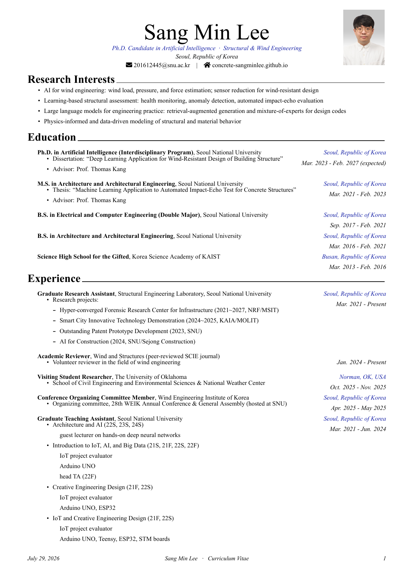
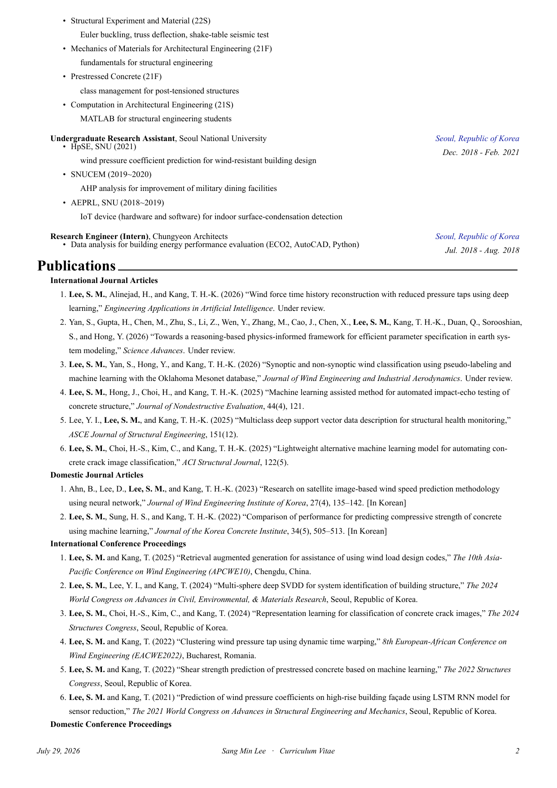
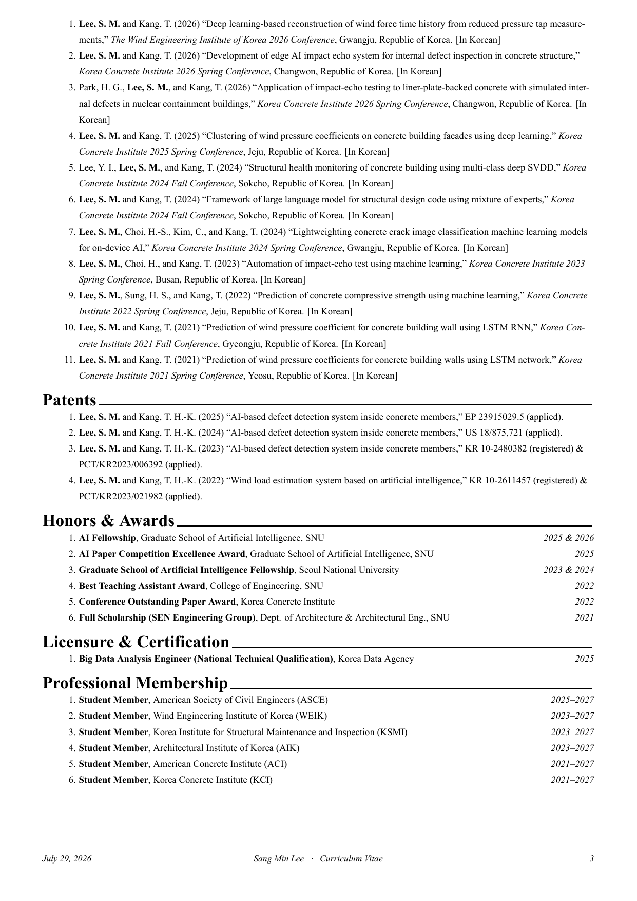

<h1 align="center">Academic CV Template for Graduate Students</h1>

<p align="center">
  A clean, single-column LaTeX CV template built on <a href="https://github.com/posquit0/Awesome-CV">Awesome-CV</a> —
  Times New Roman, a perfectly uniform baseline grid, and the sections a graduate student actually needs.
  <br>
  It ships as a complete worked example (the author's own CV) that you fork and fill in with your own content.
</p>

<p align="center">
  <a href="https://github.com/concrete-sangminlee/academic-cv-template/actions/workflows/build.yml"></a>
  <a href="https://creativecommons.org/licenses/by-sa/4.0/"></a>
  
  
</p>

<p align="center">
  
  
  
</p>

<p align="center">
  🌐 <a href="https://concrete-sangminlee.github.io/academic-cv-template/"><b>Live preview</b></a>
  &nbsp;·&nbsp;
  📄 <a href="research-cv/cv.pdf"><b>Example PDF</b></a>
</p>

## Why this template?

Customizations over vanilla Awesome-CV, aimed at a polished academic look:

- **Times New Roman throughout** — the academic standard, instead of the default sans-serif.
- **Uniform baseline grid** — every line sits on a rigid 15&nbsp;pt grid (`\cvgrid`), so line spacing stays perfectly consistent across every section.
- **Clear hierarchy** — flush-left section headers, indented content, right-aligned dates.
- **Photo + centered header** — optional 3:4 portrait alongside a page-centered name block.
- **Numbered** publications, patents, and honors.
- **Sections a grad student actually needs**, pre-built and ready to edit (see below).
- **Builds anywhere** — an automatic font fallback and a CI build that proves every commit compiles.

## Sections included

Summary · Research Interests · Education · Experience · Publications (international / domestic journals & conferences) · Patents · Honors & Awards · Licensure & Certification · Professional Membership.

Add, remove, or reorder any of them by editing the `\input{...}` lines in `cv.tex`.

## Repository structure

```
research-cv/
├── cv.tex            # Main document: personal info, packages, section includes, style knobs
├── awesome-cv.cls    # Document class (customized: Times New Roman, uniform 15 pt grid)
├── profile.jpg       # Photo (3:4 portrait)
├── cv.pdf            # Compiled example output
└── cv/               # One file per section — edit these
    ├── aboutme.tex             # Summary & Research Interests
    ├── education.tex
    ├── research_experience.tex # Experience
    ├── publications.tex        # includes publication_{journals,conf}{,_domestic}.tex
    ├── patents.tex
    ├── honors.tex              # Honors & Awards
    ├── certificates.tex        # Licensure & Certification
    ├── committees.tex          # Professional Membership
    ├── skills.tex              # optional — disabled by default
    └── teaching.tex            # optional — disabled by default
```

## Requirements

- A TeX distribution with **XeLaTeX** — TeX Live 2023+ or MacTeX (XeLaTeX is required for system-font support).
- A serif font — **Times New Roman** is used when installed, otherwise the build falls back automatically:
  - **macOS** — Times New Roman is pre-installed; nothing to do.
  - **Linux / CI** — no action needed; the template uses **TeX Gyre Termes** (a free, metric-compatible Times bundled with TeX Live).

## Build

```bash
cd research-cv
latexmk -xelatex cv.tex
```

The output is `research-cv/cv.pdf`. Convenience targets are also available from the repo root: `make pdf`, `make preview` (regenerate the README images), and `make clean`.

Every push is also compiled by GitHub Actions — see the **build** badge above.

## Make it your own

1. Click the green **Use this template** button above (or fork / clone the repo).
2. **Personal info** — edit the header block in `research-cv/cv.tex`:
   `\name`, `\position`, `\email`, `\homepage`, `\photo`.
   Optional fields are provided commented-out — uncomment what you want: `\mobile`, `\github`, `\linkedin`, `\googlescholar`.
3. **Photo** — replace `research-cv/profile.jpg` with your own 3:4 portrait (or comment out `\photo` to drop it).
4. **Content** — edit the section files in `research-cv/cv/`; each one is self-contained.
5. **Sections** — comment / uncomment the `\input{...}` lines in `cv.tex` to add, remove, or reorder sections.
6. **Spacing & fonts** (optional) — tune the knobs in the `cv.tex` preamble:
   `\cvgrid` (baseline-grid line height), `\setmainfont` (typeface), `\cvindent` (content indent).

## FAQ

<details>
<summary><b>It compiles, but the font isn't Times New Roman.</b></summary>

That's expected on Linux/CI: Times New Roman isn't installed there, so the template falls back to **TeX Gyre Termes** (a free, metric-compatible Times). To force real Times New Roman, install the Microsoft fonts (`ttf-mscorefonts-installer` on Debian/Ubuntu). To use a different serif, edit `\setmainfont` in `cv.tex`.
</details>

<details>
<summary><b>It won't compile — <code>fontspec</code> / font errors.</b></summary>

This template needs **XeLaTeX**, not pdfLaTeX. Build with `latexmk -xelatex cv.tex` (or `make pdf`), and set your editor's engine to XeLaTeX.
</details>

<details>
<summary><b>How do I change or remove the photo?</b></summary>

Replace `research-cv/profile.jpg` with your own **3:4 portrait** (the frame is 2.1 cm × 2.8 cm). To remove it, comment out the `\photo{...}` line in `cv.tex`.
</details>

<details>
<summary><b>How do I add Google Scholar, GitHub, or LinkedIn?</b></summary>

Uncomment the matching field in the header block of `cv.tex`: `\googlescholar`, `\github`, `\linkedin` (and `\mobile` for a phone number).
</details>

<details>
<summary><b>How do I make the CV shorter?</b></summary>

Trim the section content first. To tighten spacing globally, lower `\cvgrid` in the `cv.tex` preamble (e.g. from `15pt` to `14pt`); disable whole sections by commenting their `\input{...}` lines.
</details>

<details>
<summary><b>How do I change the accent color?</b></summary>

Edit `\definecolor{awesome}{HTML}{101CA4}` in `cv.tex` to your own hex color.
</details>

## Credits

- Built on [Awesome-CV](https://github.com/posquit0/Awesome-CV) by Claud D. Park ([@posquit0](https://github.com/posquit0)).
- Academic layout adapted from [Awesome-PhD-CV](https://github.com/LimHyungTae/Awesome-PhD-CV) by Hyungtae Lim.

## License

The template — the LaTeX class and document structure — is distributed under **CC BY-SA 4.0**, inherited from Awesome-CV. The example CV content is included for illustration; replace it with your own.

---

<p align="center"><sub>If this template helps with your CV, a ⭐ is appreciated — it helps other graduate students find it.</sub></p>
